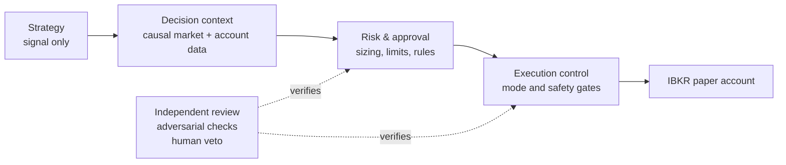

<div align="center">

# ibkr-auto-trader

### A safety-first, paper-first trading system for Interactive Brokers

[](https://www.python.org/)
[](https://docs.astral.sh/uv/)
[](https://www.interactivebrokers.com/)
[](./PROTOCOL.md)
[](./pyproject.toml)
[](./docs/design/)

*Automation should earn trust before it earns the right to trade.*

</div>

`ibkr-auto-trader` is a personal, auditable research and execution platform for a taxable Interactive Brokers account. It treats trading code—especially agent-generated code—as untrusted until it has passed independent review, adversarial verification, and human approval.

> **Paper trading only.** Live execution is intentionally out of scope unless the project’s explicit review and human-approval gates are satisfied. This repository is not investment advice.

## The operating model



The core design keeps the highest-risk concerns explicit and separate:

- **Paper-first by default** — development, validation, and broker integration start in an IBKR Paper Trading account.
- **Causal decisions** — signals and risk decisions use only information available at decision time; lookahead bias is a defect.
- **Risk is a gate, not a suggestion** — sizing, loss controls, and execution authorization sit between strategy intent and any broker adapter.
- **Evidence before trust** — every change is reviewed against the real diff, with adversarial probes for money- and safety-adjacent work.
- **Auditability throughout** — decisions, rationale, market context, and operational events are designed to be inspectable.

## What’s in the repository

| Area | Purpose |
| --- | --- |
| [`src/ibkr_trader/`](./src/ibkr_trader/) | Python trading core: domain models, durable state, IBKR account and market-data adapters, and decision seams. |
| [`tests/`](./tests/) | Fake-first and property-oriented checks for the trading core; broker integration tests are opt-in. |
| [`dashboard/`](./dashboard/) | A local observability dashboard for the append-only telemetry stream. |
| [`docs/design/`](./docs/design/) | System design, ADRs, domain glossary, and the paper-trading roadmap. |
| [`handoffs/`](./handoffs/) | Reviewable work slices and evidence of the builder → reviewer → verification workflow. |

The collab subsystem also includes a local Python mission-control dashboard. Its canonical operational
state/history, resumable live transport, separate health dimensions, and LiteLLM/Langfuse routing contract
are documented in [`docs/design/dashboard-operational-state.md`](./docs/design/dashboard-operational-state.md).

## Quick start

This project targets **Python 3.14+** and uses [uv](https://docs.astral.sh/uv/) for Python dependency management.

```bash
uv sync --all-groups
uv run --locked pytest -q -m "not integration"
uv run --locked ruff check src tests scripts/verify.py
uv run --locked pyright
```

Ruff is scoped to the core code (`src`, `tests`, and the verifier itself) because that scope is clean;
a whole-repo `ruff check .` also surfaces ~321 pre-existing findings in the collab workflow that are
tracked as a separate cleanup, not a release gate.

### One authoritative check

`scripts/verify.py` is the source of truth for "is the checkout green?". Its unflagged invocation
composes the intended checks for every supported subsystem — lockfile first, Python core (pytest,
scoped Ruff, Pyright), the collab workflow suite, and the dashboard (vitest, Oxlint, Oxfmt, Next
build) — and prints one fail-closed matrix:

```bash
uv run --locked python scripts/verify.py  # full matrix; fails if pnpm is unavailable
uv run --locked python scripts/verify.py --python-only  # explicit partial result: skips dashboard
uv run --locked python scripts/verify.py --no-build     # explicit partial result: skips Next build
```

`--python-only` and `--no-build` exit successfully only for their requested scope and report
`PARTIAL PASS`; neither claims the checkout is green. The normal core test command always excludes
the `integration` marker, even if `IBKR_INTEGRATION` is set. The verifier deliberately does **not**
gate collab lint or dashboard Playwright e2e; those exclusions are printed in the summary rather
than hidden.

The normal test suite is fake-based and does not require an IBKR Gateway. The optional integration marker is reserved for an explicitly configured paper Gateway:

```bash
# Bash
IBKR_INTEGRATION=1 uv run pytest -m integration
```

```powershell
# PowerShell
$env:IBKR_INTEGRATION = "1"
uv run pytest -m integration
```

### Observability dashboard

The dashboard presents run statistics and live telemetry events from `logs/telemetry.jsonl`.

```bash
cd dashboard
pnpm install
pnpm dev
```

It starts at [http://localhost:3007](http://localhost:3007). See the [dashboard README](./dashboard/README.md) for its test, build, and deployment notes.

## How changes earn their way in

This repository uses a deliberately skeptical workflow for material changes:

1. A builder proposes a small, reviewable handoff.
2. An independent reviewer inspects the actual diff and its safety implications.
3. Money-, risk-, and safety-adjacent work receives adversarial regression checks.
4. A human retains final veto authority.

The project [protocol](./PROTOCOL.md) is the source of truth for these guardrails. Read it before changing execution, sizing, market data, or risk controls.

## Explore the design

- [System architecture](./ARCHITECTURE.md)
- [Trading-system design](./docs/design/trading-system-design.md)
- [Architecture decisions](./docs/design/adr/)
- [Shared domain language](./CONTEXT.md)
- [Paper-trading roadmap](./docs/design/paper-trading-roadmap.md)
- [Builder and reviewer roles](./AGENT-INSTRUCTIONS.md)

## Safety note

This is an active engineering project for a personal account, not a public trading product or a recommendation to buy or sell any security. Do not point unreviewed code at a live brokerage account.
